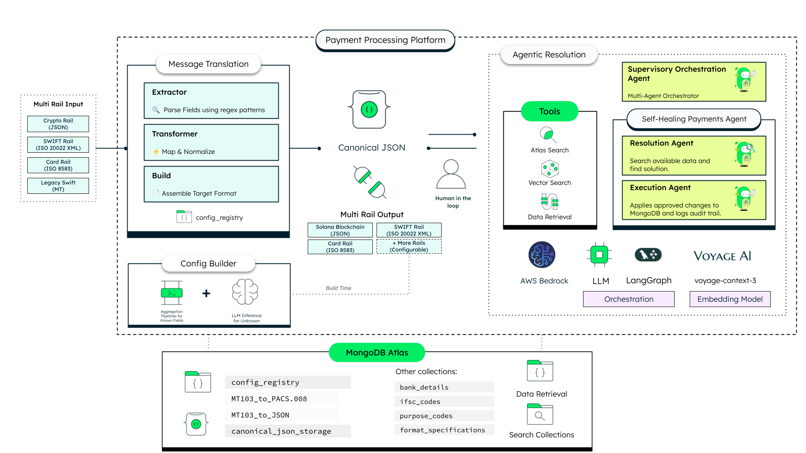
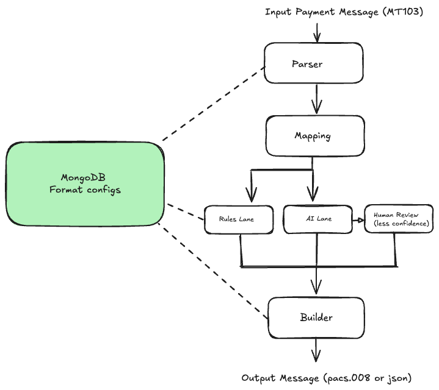
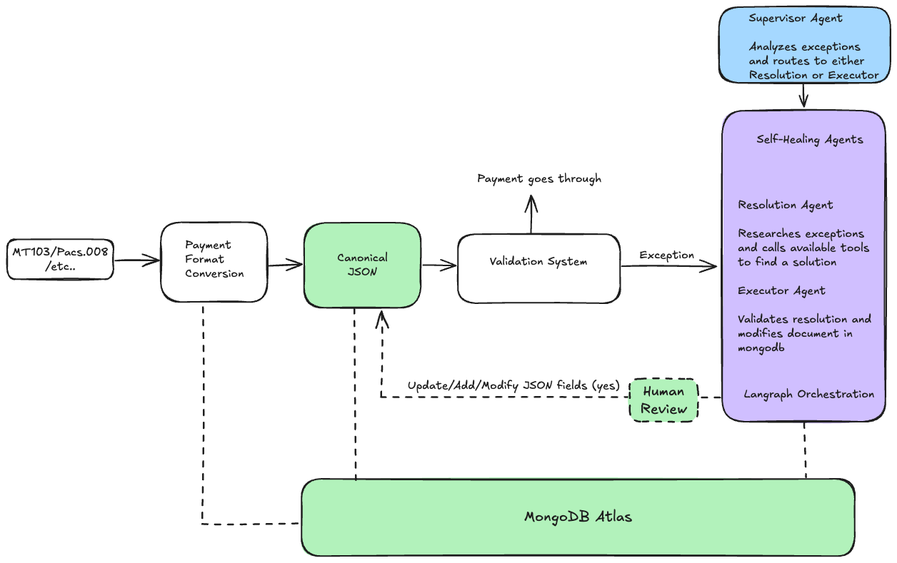
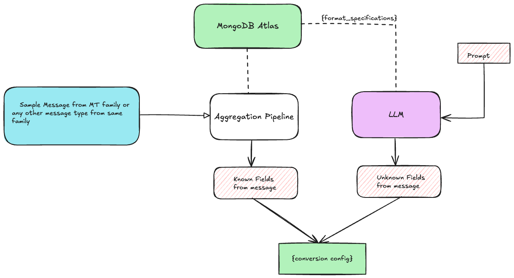

# Agentic Payments Platform

Demonstrates Agentic AI combined with MongoDB Atlas's flexible document model simplifies payment orchestration across legacy SWIFT, modern ISO 20022, and emerging rails

## Where MongoDB Shines

- **Schema Flexibility**: MongoDB's document model aligns naturally with canonical payment formats. Store canonical JSON, metadata, and audit trails in a single document. Evolve data models without migrations and handle diverse message structures (MT103, pacs.008, ISO 8583, crypto) without schema conflicts.
- **Atlas Search for Typo-Tolerant Resolution**: The Resolution Agent uses Atlas Search when exact lookups fail — typo tolerance up to 2 edit distance, compound queries across multiple fields, no external search infrastructure required.
- **Atlas Vector Search for Semantic Matching**: Semantic similarity to classify payment descriptions (e.g., "paying wages" maps to purpose code SALA), built into Atlas without a separate vector database.
- **Aggregation Pipelines for Adaptive Learning**: The Adaptive Learning Service uses `$objectToArray` and `$unwind` to build field-to-mapping lookups from all configs in one query — database-level processing for instant pattern reuse when onboarding new formats.
- **Automatic Document Updates**: Single-document atomicity ensures the Execution Agent updates payment fields and logs the audit trail in one operation — critical for regulatory compliance in financial services.

## High Level Architecture



## Tech Stack

- **[MongoDB Atlas](https://www.mongodb.com/atlas)** for the operational data layer (configs, canonical JSON, audit trails)
- **[MongoDB Atlas Search](https://www.mongodb.com/docs/atlas/atlas-search/)** for typo-tolerant fuzzy matching in payment repair
- **[MongoDB Atlas Vector Search](https://www.mongodb.com/docs/atlas/atlas-vector-search/)** for semantic classification (e.g., purpose code resolution)
- **[LangGraph](https://langchain-ai.github.io/langgraph/)** for the multi-agent workflow (supervisor → resolution → human review → execution)
- **[AWS Bedrock](https://aws.amazon.com/bedrock/)** (Anthropic Claude) for AI-powered field extraction
- **[Voyage AI](https://www.voyageai.com/)** for embedding generation used by Atlas Vector Search
- **[Next.js 15](https://nextjs.org/)** App Router for the frontend framework
- **[FastAPI](https://fastapi.tiangolo.com/)** (Python) for the Converter and Agent backend services
- **[LeafyGreen UI](https://github.com/mongodb/leafygreen-ui)** (MongoDB's design system) for frontend components
- **CSS Modules** for component-scoped styling

## Prerequisites

Before you begin, ensure you have met the following requirements:

- **Python 3.13** (but less than 3.14)
- **Node.js 22** or higher
- **uv** (install via [uv's official documentation](https://docs.astral.sh/uv/getting-started/installation/))
- **MongoDB Atlas** cluster with Atlas Search and Vector Search configured
- **AWS credentials** with Bedrock access (for AI lane processing and AI Agent Resolution)
- **Voyage AI API key** for embedding generation used by Atlas Vector Search (get one at [Voyage AI's dashboard](https://dash.voyageai.com/api-keys))
- **Docker & Docker Compose** (optional, for containerized deployment)

## Initial Configuration

### Obtain Your MongoDB Connection String

1. Set up a [MongoDB Atlas](https://www.mongodb.com/atlas) cluster if you don't have one already.
2. Locate your cluster, click **Connect**, and select **Connect your application**.
3. Copy the connection string.

> You'll need this connection string for the `MONGODB_URI` environment variable later.

### Set Up AWS Bedrock Access

1. Log in to the [AWS Management Console](https://aws.amazon.com/console/).
2. Navigate to the **Bedrock** service (or search for "Bedrock" in the AWS search bar).
3. Request access to the Bedrock service if you haven't already.
4. Once access is granted, create an IAM user with programmatic access and the appropriate Bedrock permissions.
5. Save the **AWS Access Key ID** and **Secret Access Key** for use in your environment variables.

> Keep your AWS credentials secure and never commit them to version control.

### Clone the Repository

1. Open your terminal and navigate to the directory where you want to store the project:

   ```bash
   cd /path/to/your/desired/directory
   ```

2. Clone the repository:

   ```bash
   git clone <repository-url>
   ```

3. Navigate into the cloned project:

   ```bash
   cd fsi-payments-processing
   ```

### Populate Seed Data

The demo requires seed data to run. JSON files are provided in `backend/data/` — import them into your Atlas cluster using [MongoDB Compass](https://www.mongodb.com/products/tools/compass):

1. Open MongoDB Compass and connect using your Atlas connection string.
2. Create a database called `fsi-payments-processing` (or whatever you set as `DATABASE_NAME`).
3. For each file in `backend/data/`, create the matching collection and import the JSON file:

   | File | Collection |
   | ---- | ---------- |
   | `fsi-payments-processing.conversion_configs.json` | `conversion_configs` |
   | `fsi-payments-processing.format_specifications.json` | `format_specifications` |
   | `fsi-payments-processing.bank_details.json` | `bank_details` |
   | `fsi-payments-processing.ifsc_codes.json` | `ifsc_codes` |
   | `fsi-payments-processing.purpose_codes.json` | `purpose_codes` |
   | `fsi-payments-processing.registered_entities.json` | `registered_entities` |

4. To import: click the collection name, then **Add Data** → **Import JSON or CSV file**, and select the corresponding file from `backend/data/`.

> All six collections are required for the full demo experience. `conversion_configs` and `format_specifications` power the converter. The remaining four are used by the payment agent for resolution lookups.

### Create Atlas Search and Vector Search Indexes

The payment agent relies on Atlas Search and Atlas Vector Search indexes for fuzzy lookups and semantic matching. Create these in the Atlas UI under **Database** → **Atlas Search**.

**1. `bank_details_search`** — Atlas Search index on `bank_details`

Index name: `bank_details_search`

```json
{
  "mappings": {
    "dynamic": false,
    "fields": {
      "name_english": { "type": "string", "analyzer": "lucene.standard" },
      "name_katakana": { "type": "string", "analyzer": "lucene.standard" },
      "bank_name": { "type": "string", "analyzer": "lucene.standard" },
      "city": { "type": "string", "analyzer": "lucene.standard" },
      "country": { "type": "string", "analyzer": "lucene.keyword" },
      "swift_code": { "type": "string", "analyzer": "lucene.keyword" }
    }
  }
}
```

**2. `ifsc_codes_search`** — Atlas Search index on `ifsc_codes`

Index name: `ifsc_codes_search`

```json
{
  "mappings": {
    "dynamic": false,
    "fields": {
      "ifsc": { "type": "string", "analyzer": "lucene.standard" },
      "bank": { "type": "string", "analyzer": "lucene.standard" },
      "branch": { "type": "string", "analyzer": "lucene.standard" },
      "city": { "type": "string", "analyzer": "lucene.standard" },
      "district": { "type": "string", "analyzer": "lucene.standard" },
      "state": { "type": "string", "analyzer": "lucene.standard" },
      "address": { "type": "string", "analyzer": "lucene.standard" }
    }
  }
}
```

**3. `registered_entities_search`** — Atlas Search index on `registered_entities`

Index name: `registered_entities_search`

```json
{
  "mappings": {
    "dynamic": false,
    "fields": {
      "legal_name": { "type": "string", "analyzer": "lucene.standard" },
      "trading_names": { "type": "string", "analyzer": "lucene.standard" },
      "country": { "type": "string", "analyzer": "lucene.standard" },
      "status": { "type": "string", "analyzer": "lucene.standard" }
    }
  }
}
```

**4. `purpose_codes_vector`** — Atlas Vector Search index on `purpose_codes`

Index name: `purpose_codes_vector`

```json
{
  "fields": [
    {
      "type": "vector",
      "path": "embedding",
      "numDimensions": 1024,
      "similarity": "cosine"
    },
    {
      "type": "filter",
      "path": "category"
    }
  ]
}
```

#### How to Create Atlas Search Indexes (indexes 1–3)

1. Go to [Atlas](https://cloud.mongodb.com/) and select your cluster.
2. Click **Atlas Search** in the left sidebar.
3. Click **Create Search Index**.
4. Select **Atlas Search** as the index type, then click **Next**.
5. Choose the **JSON Editor** for the configuration method.
6. Select the target collection (e.g., `bank_details`).
7. Set the **Index Name** (e.g., `bank_details_search`).
8. Replace the default definition with the JSON above for that index.
9. Click **Next**, review the settings, then click **Create Search Index**.
10. Repeat for each of the three Atlas Search indexes.

#### How to Create the Atlas Vector Search Index (index 4)

1. From the **Atlas Search** page, click **Create Search Index**.
2. Select **Atlas Vector Search** as the index type, then click **Next**.
3. Choose the **JSON Editor** for the configuration method.
4. Select the `purpose_codes` collection.
5. Set the **Index Name** to `purpose_codes_vector`.
6. Replace the default definition with the JSON above.
7. Click **Next**, review, then click **Create Search Index**.

> Indexes take a few seconds to build. Wait until the status shows **Active** before running the demo.

## Run it Locally

### Backend

1. (Optional) Set your project description and author information in the `backend/payment_converter_v2/pyproject.toml` file:

   ```toml
   description = "Your Description"
   authors = [{name = "Your Name", email = "you@example.com"}]
   ```

2. Open the project in your preferred IDE (the standard for the team is Visual Studio Code).

3. Open the Terminal within Visual Studio Code.

4. Ensure you are in the root project directory where the `Makefile` is located.

5. Execute the following commands:

   **uv initialization:**

   ```bash
   make uv_init
   ```

   **uv sync:**

   ```bash
   make uv_sync
   ```

6. Verify that the `.venv` folder has been generated within the `/backend` directory.

7. Create `.env` files for each backend service. Use `backend/.env.example` as a reference:

   **`backend/payment_converter_v2/.env`:**

   ```bash
   MONGODB_URI=
   DATABASE_NAME=f
   AWS_DEFAULT_REGION=
   PAYMENT_AGENT_URL=
   CORS_ORIGINS=
   ```

   **`backend/payment_agent/.env`:**

   ```bash
   MONGODB_URI=
   DATABASE_NAME=
   AWS_REGION=
   VOYAGE_API_KEY=
   ```

### Frontend

1. Navigate to the `frontend` folder.

2. Create a `.env.local` file:

   ```bash
   BACKEND_API_URL=http://localhost:8001
   NEXT_PUBLIC_API_URL=http://localhost:8001
   ```

3. Install dependencies by running:

   ```bash
   npm install
   ```

### Running Locally

After setting up both backend and frontend dependencies, start all services with:

```bash
make dev
```

This starts the converter (port 8001), agent (port 8002), and frontend (port 3000) together.

- **Frontend**: <http://localhost:3000>
- **Converter API**: <http://localhost:8001>
- **Agent API**: <http://localhost:8002>

You can also run services separately:

```bash
make dev-backend    # Converter (8001) + Agent (8002) only
make dev-frontend   # Frontend (3000) only
make dev-converter  # Converter (8001) only
make dev-agent      # Agent (8002) only
```

**Useful commands:**

```bash
make dev-logs      # Tail all service logs
make dev-status    # Check which services are running
make dev-stop      # Stop all services
make dev-kill-all  # Force-kill all processes on ports 3000-3009 and 8000-8009
```

> **Note:** If ports are already in use (e.g., by Docker containers), either stop the containers with `make clean` or run `make dev-kill-all` to free the ports.

## Run with Docker

Make sure to run this on the root directory.

To run with Docker use the following command:

```bash
make build
```

This starts three containers:

- **Converter**: <http://localhost:8001>
- **Agent**: <http://localhost:8002>
- **Frontend**: <http://localhost:3000>

To delete the containers and images run:

```bash
make clean
```

## Common Errors

### Backend Errors

- Check that you've created `.env` files in `backend/payment_converter_v2/` and `backend/payment_agent/` that contain your valid (and working) MongoDB URI and AWS credentials.
- Ensure your MongoDB Atlas cluster has Atlas Search indexes configured for the `bank_details` and `ifsc_codes` collections if using the payment agent.
- Verify AWS credentials have Bedrock model access (Claude Haiku / Sonnet).

### Frontend Errors

- Check that you've created a `.env.local` file in `frontend/` that contains the correct `BACKEND_API_URL` pointing to your running converter service.
- If LeafyGreen UI components fail to load, delete `node_modules` and run `npm install` again.
- Ensure Node.js version is 22 or higher (`node --version`).

## Core Capabilities

Two services power the platform. The **Message Translation Service** converts payment formats through a 3-lane pipeline. The **Payment Agent** repairs failed transactions using a LangGraph multi-agent workflow. Both use MongoDB Atlas as their shared data layer.

### Message Translation



Every conversion pair (e.g., MT103 → pacs.008) lives as a configuration document in MongoDB. Each config has three parts:

- **Parser**: Regex patterns that extract fields from the source message.
- **Mapping**: Routes each field through the **Rules** lane (deterministic transforms) or the **AI** lane (for unstructured text like remittance info).
- **Builder**: Assembles the target format from transformed fields.

Want to add a new format? Insert a config document. No code changes needed.

### Canonical JSON

All payment formats map to a single, flat JSON structure. MT103, ISO 8583, pacs.008, blockchain — they share the same field names for equivalent concepts. This gives you multi-hop routing (e.g., MT103 → JSON → pacs.009) and preserves ISO 20022's full data richness without truncation.

```json
{
  "transaction_ref": "MED-CH-ZA-2024-001",
  "value_date": "2024-12-15",
  "amount": "180000.00",
  "currency": "CHF",
  "debtor_name": "SWISS PHARMA INTERNATIONAL AG",
  "debtor_account": "CH9300762011623852957",
  "creditor_name": "SOUTH AFRICAN HEALTH SUPPLIES PTY LTD",
  "creditor_account": "ZA123456789012345678901",
  "remittance_info": "INVOICE MED-ZA-2024-5678",
  "charge_bearer": "SHA",
  "metadata": { "..." }
}
```

### Agentic Payment Resolution



Payments don't just get rejected when validation fails — missing IFSC codes, wrong scripts, ambiguous names. Instead, a **Supervisor Agent** routes the problem to specialized workers:

- The **Resolution Agent** searches MongoDB with Atlas Search (fuzzy text), Vector Search (semantic similarity), or LLM inference to find the right value.
- The **Execution Agent** applies the approved fix and logs an audit trail.

Before any change goes through, LangGraph pauses the workflow for **human review**. You see the original value, the proposed fix, and the reasoning. Approve, reject, or modify — then the workflow resumes.

### Config Builder



Provide a sample message and the system does the rest. It runs a MongoDB aggregation pipeline across all existing configs, auto-detects the format (SWIFT, ISO 8583, ISO 20022), and matches fields against learned patterns. For fields it doesn't recognize, an LLM suggests mappings constrained by the target format spec. You review and approve before anything becomes permanent.

## Additional Resources

### MongoDB Resources

- [MongoDB for Financial Services](https://www.mongodb.com/solutions/industries/financial-services)
- [MongoDB Atlas](https://www.mongodb.com/atlas)
- [MongoDB Atlas Search Documentation](https://www.mongodb.com/docs/atlas/atlas-search/)
- [MongoDB Atlas Vector Search](https://www.mongodb.com/docs/atlas/atlas-vector-search/)
- [MongoDB Aggregation Pipelines](https://www.mongodb.com/docs/manual/aggregation/)
- [MongoDB LeafyGreen UI](https://github.com/mongodb/leafygreen-ui)

### Frameworks and Services

- [LangGraph](https://langchain-ai.github.io/langgraph/) — multi-agent orchestration with human-in-the-loop
- [AWS Bedrock](https://aws.amazon.com/bedrock/) — managed LLM access (Anthropic Claude)
- [Voyage AI](https://www.voyageai.com/) — embedding generation for vector search
- [Next.js 15](https://nextjs.org/) — React framework with App Router
- [FastAPI](https://fastapi.tiangolo.com/) — Python async API framework